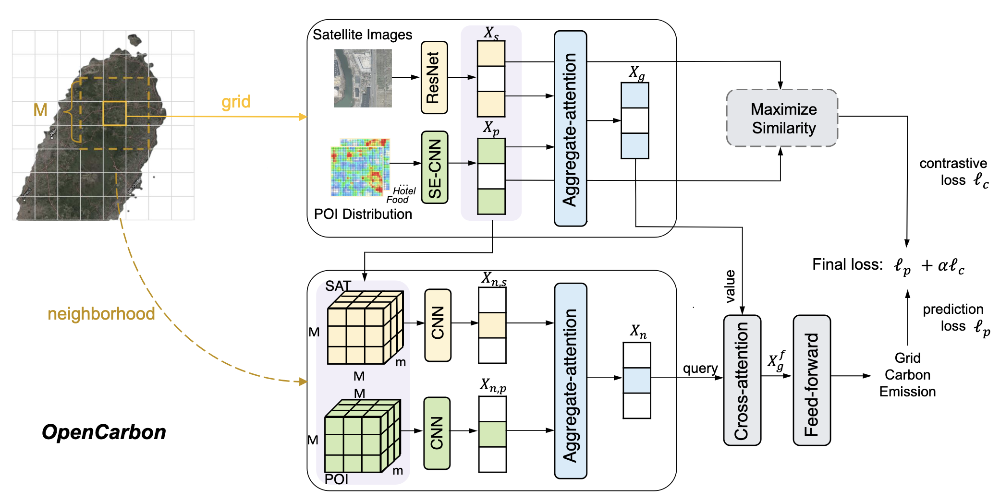

# OpenCarbon

This repo is the official implementation for the paper   
OpenCarbon: A Contrastive Learning-based Cross-Modality Neural Approach for High-Resolution Carbon Emission Prediction Using Open Data

## Overall architecture
This work aims to construct a prediction framework that predicts high-resolution carbon emissions with open data of satellite images and POI. 



## Data
We conduct experiments on cities that span both developed and developing countries, including London, Beijing, and Yinchuan. Summary of the datasets are presented:

| Region      | Great London | Beijing     | Yinchuan   |
|-------------|-------------:|------------:|-----------:|
| Area        | 778 km²      | 1381 km²    | 475 km²    |
| GDP pc ($)  | 71k          | 27k         | 12k        |
| POI Source  | SafeGraph    | Map Service | Map Service|
| Target Year | 2018         | 2018        | 2019       |
*Table 1: The summary statistics of our datasets.*

Due to the size limit of github, we have stored the data in an anonymous google drive link: https://drive.google.com/drive/folders/1_HHa5X6nLiB4mHfEIn42jb5fwc64nf0v?usp=sharing. 
[Due to cloud storage limit, we only update the Beijing dataset. All other datasets are available through email requests.] 
Please download them and place them inside /data.

## Installation
### Environment
- Tested OS: Linux
- Python >= 3.8
- torch == 2.2.1
- Tensorboard


## Config 
Configs for performance reproductions on all datasets. 


### London
```
python main_contrastive.py --city london --batch_size 32 --lr 1e-3 --epochs 3000 --contrastive 1 --alpha 0.001
```

### Beijing
```
python main_contrastive.py --city beijing --batch_size 32 --lr 1e-3 --epochs 3000 --contrastive 1 --alpha 0.001
```

### Yinchuan
```
python main_contrastive.py --city yinchuan --batch_size 32 --lr 5e-4 --epochs 3000 --contrastive 1 --alpha 0.01
```
